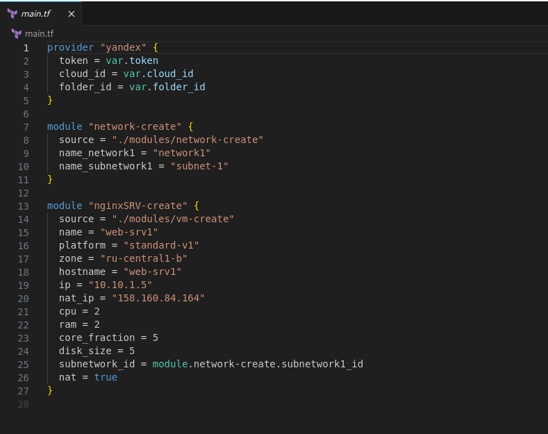
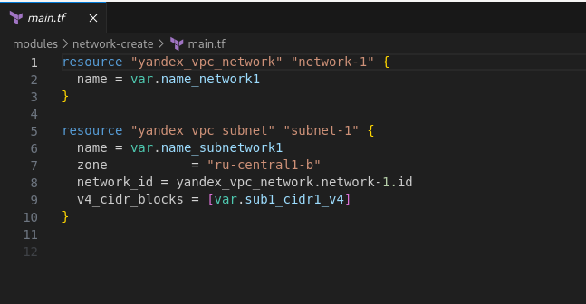
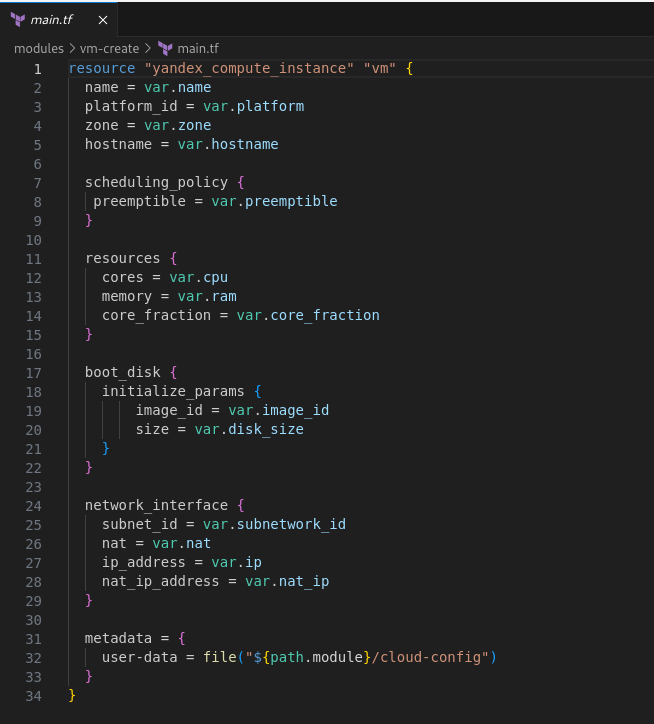
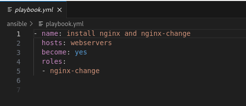
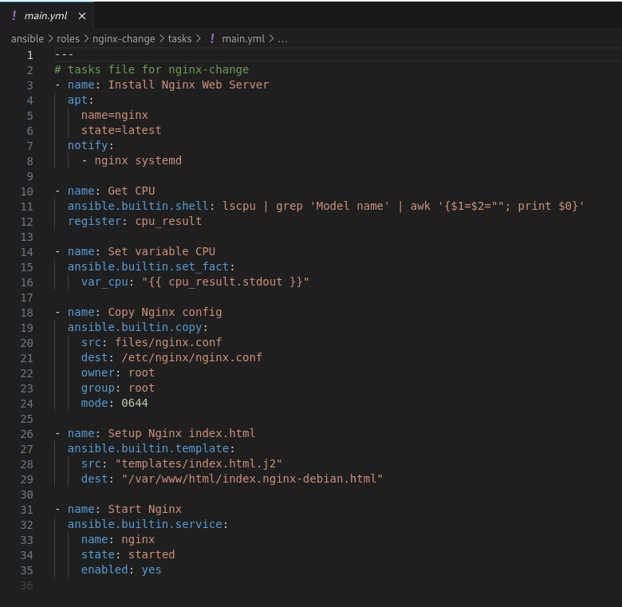
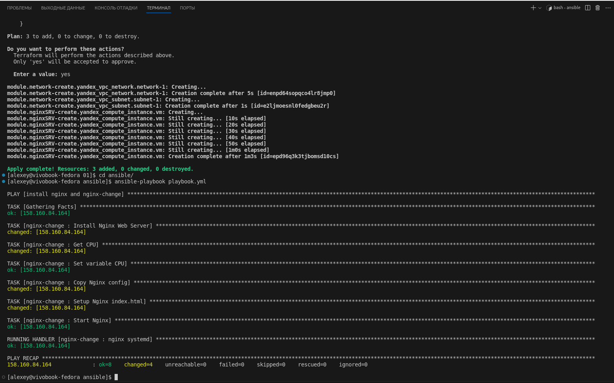
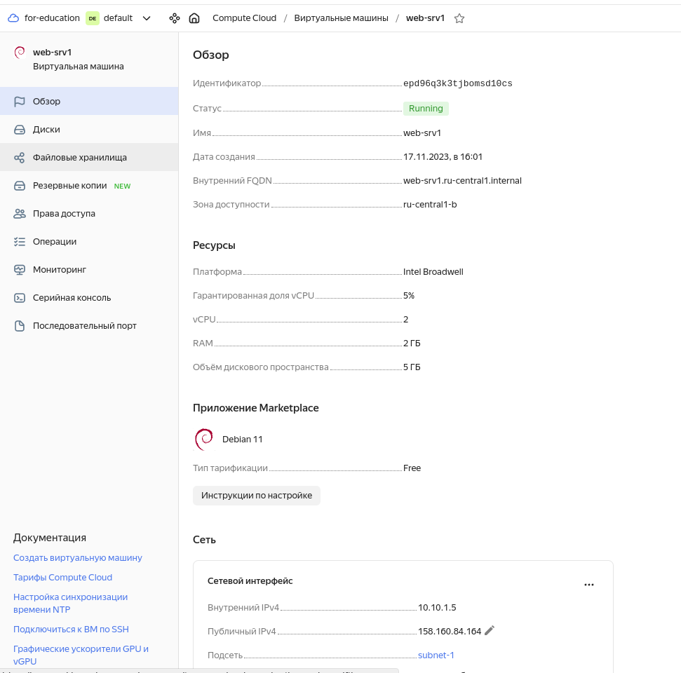
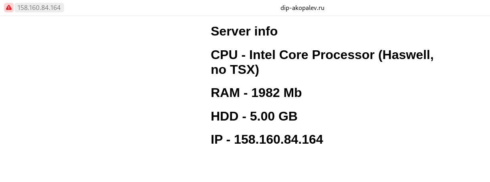

#  Копалев А. С. - Домашняя работа № 1

## Задача
Реализовать терраформ для разворачивания одной виртуалки в yandex-cloud;
Запровиженить nginx с помощью ansible.

## Реализация
Для развёртки инфраструктуры использовался Terraform и Ansible.
Через Terraform в Yandex Cloud создаются следующие ресурсы (через модули):
- Облачная сеть - network1
- 1 подсеть - subnet-1
- 1 виртуальная машина web-srv1 с внешним IP-адресом, доступ по SSH

Через Ansible устанавливается nginx и заменяется его конфиг (реализация через роли)

[main.tf](./main.tf)

[playbook.tf](./ansible/playbook.yml)

## Описание пошагового выполнения со скриншотами

- main.tf
  

- модуль создания сети и подсети
  

- модуль создания виртуалки
  

- playbook.yml
  

- роль установки и замены конфига nginx
  

- вывод terraform и ansible
  
-  [terraform-output.txt](./terraform-output.txt)
  
- [ansible-output.txt](./ansible-output.txt)
  

-   Скриншот из yandex cloud

- скриншот рабочего веб-сервера
  

