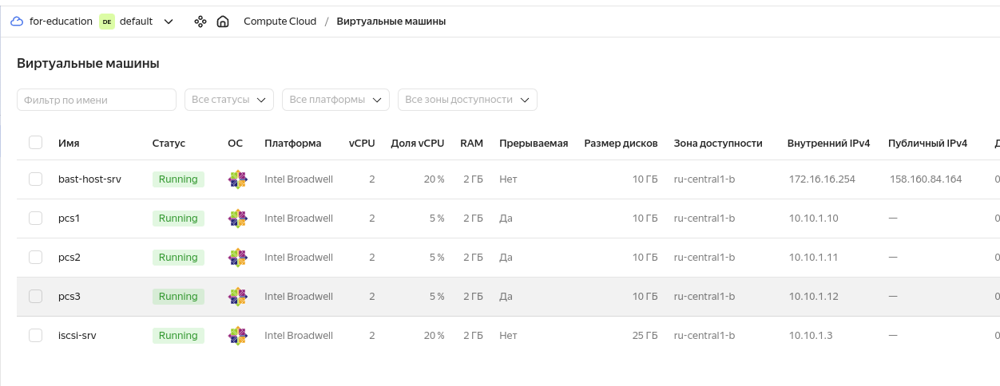
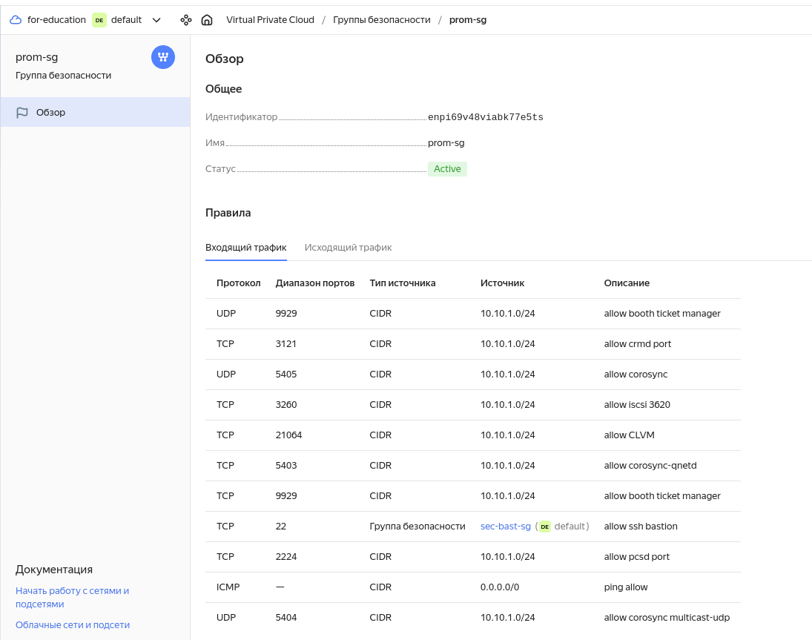
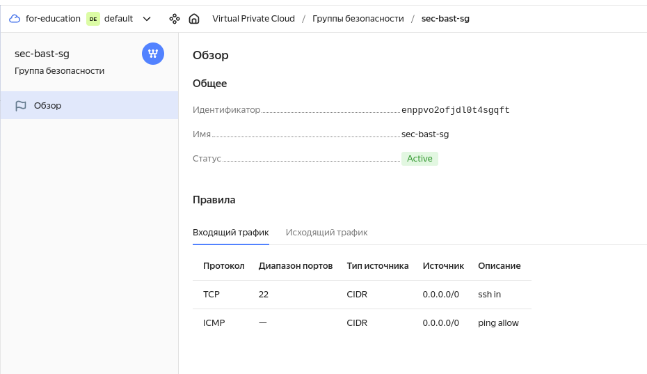
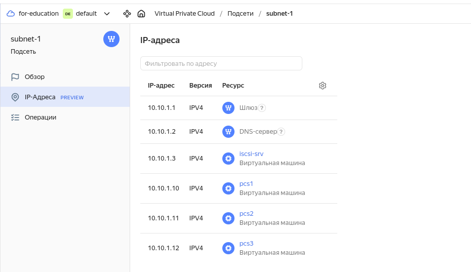
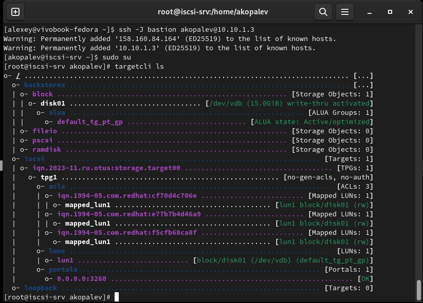
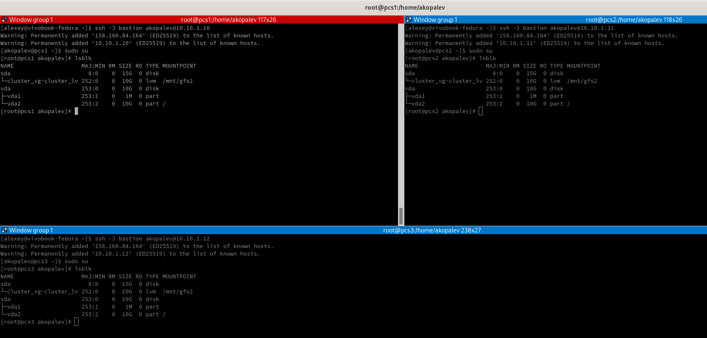
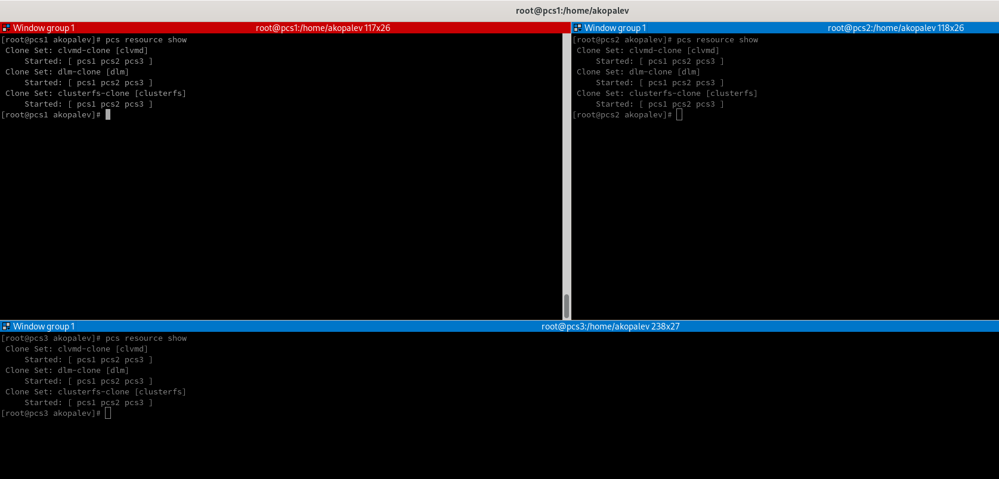
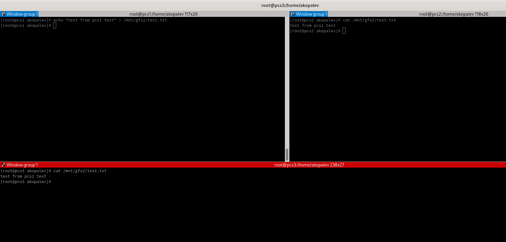
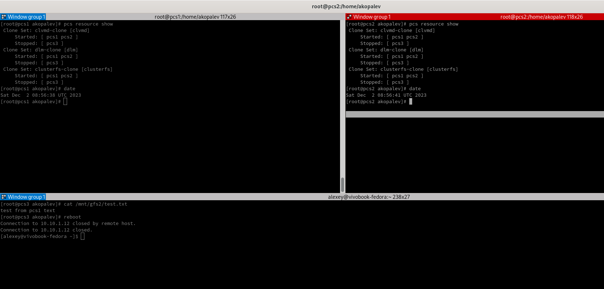
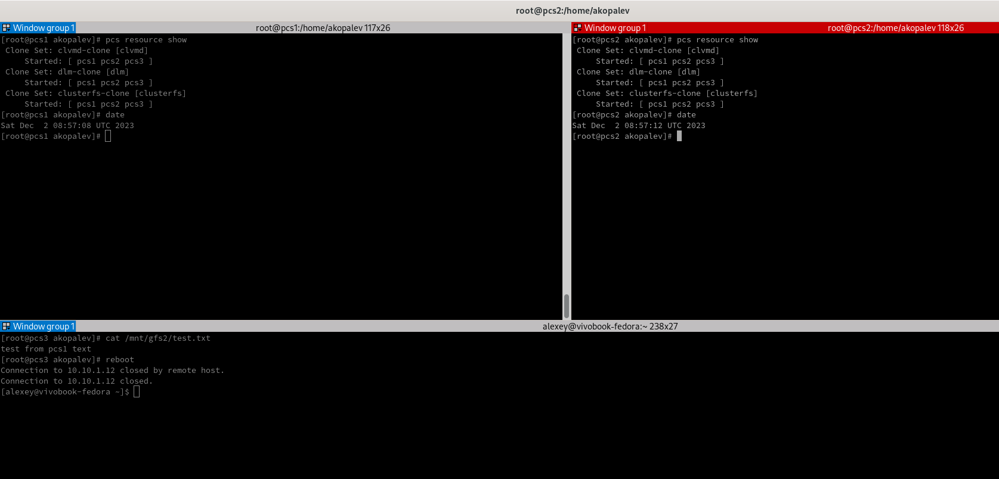

#  Копалев А. С. - Домашняя работа № 2

## Задача
Реализация GFS2 хранилища на виртуалках в Yandex Cloud.
Развернуть в Yandex Cloud следующую конфигурацию с помощью terraform.
Виртуалка с iscsi
3 виртуальные машины с разделяемой файловой системой GFS2 поверх cLVM

## Реализация
Для развёртки инфраструктуры использовался Terraform и Ansible.
Через Terraform в Yandex Cloud создаются следующие ресурсы (через модули):
- Облачная сеть - network1
- 2 подсети - subnet-1, для виртуальных машин кластера и iscsi-сервера и subnet-bast, для бастионного хоста
- 1 виртуальная машина bast-host-srv с внешним IP-адресом, доступная по SSH, реализующая SSH доступ к остальным виртуалкам
- 1 виртуальная машина iscsi-srv с дополнительным диском, который предоставляется как блочное устройство через tergetcli для кластера Pacemaker
- 3 виртуальные машины для кластера Pacemaker

[main.tf](./main.tf)

Через Ansible реализуются 3 роли:
 - "install targetcli, create lun" - устанавливает targetcli, создает LUN, прописывает ACL клиентов (переменные зашифрованы через ansible-vault)
 - "install iscsi-client" - устанавливает iscsi-клиент, подключает LUN с сервера как блочное устройство
 - "install ha-cluster" - устанавливает pacemaker, pcs, fence agent, lvm2-cluster, gfs2. Настраивает кластер, создает необходимые ресурсы, создает кластерную ФС.

[playbook.tf](./ansible/playbook.yml)

## Скриншоты из Yandex Cloud, созданных виртуальных машин, выводы при выполнении terraform apply и ansible-playbook playbook.yml

- виртуальные машины в Yandex Cloud
  

- группа безопасности prom-sg с необходимыми портами 
  

- группа безопасности sec-bast-sg с открытым 22 портом
  

- назначенные ip-адреса
  

- вывод с сервера iscsi с созданным LUN и прописанными ACL
  

- выводы lsblk с виртуальных машин кластера

- ресурсы pcs

- тест работы обшей файловой системы на виртуалках кластера

- остановка работы одной из виртуалок

- восстановление работы кластера

- вывод terraform и ansible
  
- [terraform-output.txt](files/terraform-output.txt)
  
- [ansible-output.txt](files/ansible-output.txt)