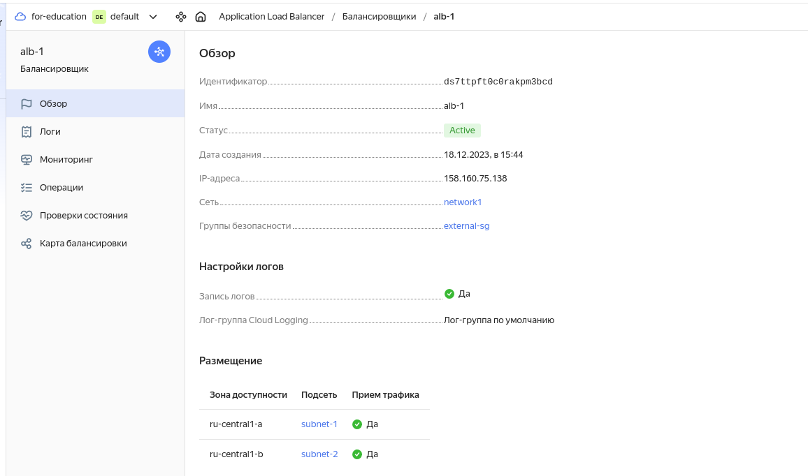
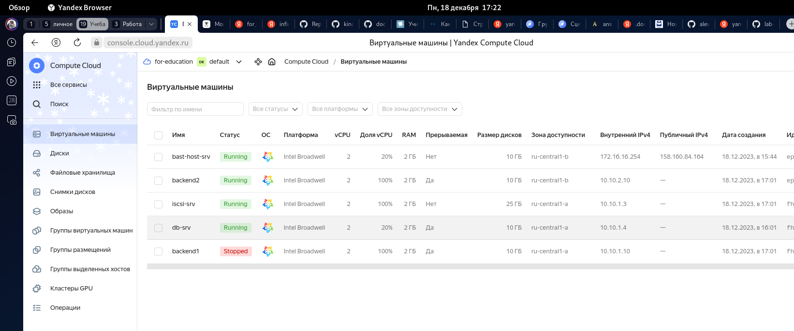

#  Копалев А. С. - Домашняя работа № 4

## Задача
Настройка конфигурации веб приложения под высокую нагрузку
#### Цель:
terraform (или vagrant) и ansible роль для развертывания серверов веб приложения под высокую нагрузку и отказоустойчивость
в работе должны применяться:
keepalived, (в случае использовать vagrant и virtualbox), load balancer от yandex в случае использования яндекс клауд
nginx,
uwsgi/unicorn/php-fpm
некластеризованная бд mysql/mongodb/postgres/redis
## Реализация
Для развертывания инфраструктуры использовался Terraform и Ansible.
Через Terraform в Yandex Cloud создаются следующие ресурсы (через модули):
- Облачная сеть - network1
- 3 подсети - subnet-1 и subnet-2, для сервера ISCSI, для виртуальных машин бэкенда, сервера БД и subnet-bast, для бастионного хоста
- 1 виртуальная машина bast-host-srv с внешним IP-адресом, доступная по SSH, реализующая SSH доступ к остальным виртуалкам
- DNS зону - zone1, A-запись для домена dip-akopalev.ru
- 1 виртуальная машина для сервера ISCSI с дополнительным диском
- 1 виртуальная машина для БД MySQL
- 2 виртуальные машины для бэкенда Wordpress
- 1 Yandex Application Load Balancer в качестве балансировщика

[main.tf](./main.tf)

Через Ansible реализуются 6 ролей:
 - "chrony" - установка и синхронизация времени на всех виртуальных машинах
 - "targetcli" - устанавливает targetcli, создает LUN, прописывает ACL клиентов (переменные зашифрованы через ansible-vault) для использования в качестве общей ФС gfs2 для бэкенд серверах, для хранения статики
 - "iscsi-client" - устанавливает iscsi-клиент, подключает LUN с сервера как блочное устройство 
 - "ha-cluster" - станавливает pacemaker, pcs, fence agent, lvm2, lvm2-lockd, dlm,gfs2-utils. Настраивает кластер, создает необходимые ресурсы, создает кластерную ФС.
 - "db" - устанавливает MySQL, задает пароль root, создает БД, пользователя и пароль для Wordpress (переменные зашифрованы через ansible-vault)
 - "wordpress" - устанавливает на бэкенд сервера nginx и каталог wordpress в директорию но общей ФС, заменяет их конфиги

[playbook.tf](./ansible/playbook.yml)

## Скриншоты из Yandex Cloud, созданного сайта, выводы при выполнении terraform apply и ansible-playbook playbook.yml

- созданные ресурсы в Yandex Cloud
  

- созданные виртуальные машины
  

- созданные сети
  

- созданные подсети
  

- группы безопасности
  

- открытые порты для группы безопасности external-sg

- открытые порты для группы безопасности internal-sg

- открытые порты для группы безопасности sec-bast-sg

- Используемые IP-адреса

- Балансировщик Yandex Application Load Balancer

- HTTP-роутер

- группа бэкендов

- Целевая группа

- балансировщик

- проверки состояния Application Load Balancer

- Карта балансировки

- DNS записи

- Завершение установки Wordpress

- Работа админки сайта

- Проверка работы сайта

- pcs status на одной из нод бэкенда

- lsbkl

- выключение бэкенд 2

- pcs status на второй ноде

- состояние виртуалок

- Проверки состояния Application Load Balancer

- Проверка работы админки сайта

- Проверка работы сайта

- включение бэкенд 2

- Проверки состояния Application Load Balancer

- pcs status

- Проверка работы админки сайта

- отключение бэкенд 1 и pcs status на бэкенд 2

- состояние виртуалок

- Проверки состояния Application Load Balancer

- Проверка работы админки сайта

- Проверка работы сайта

- включение бэкенд 1 и pcs status на бэкенд 2

- состояние виртуалок

- Проверки состояния Application Load Balancer

- Проверка работы админки сайта

- вывод terraform и ansible
  
- [terraform-output.txt](files/terraform-output.txt)
  
- [ansible-output.txt](files/ansible-output.txt)