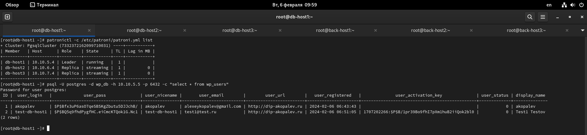

#  Копалев А. С. - Домашняя работа № 6

## Задача
Реализация кластера postgreSQL с помощью patroni.
#### Цель
Перевести БД веб проекта на кластер postgreSQL с ипользованием patroni, etcd/consul/zookeeper и haproxy/pgbouncer.
#### Описание/Пошаговая инструкция выполнения домашнего задания:
Разворачиваем отказоустойчивый кластер postgreSQL с ипользованием patroni, etcd и haproxy на ВМ в Yandex Cloud.
Создаем внутри кластера вашу БД для проекта
#### Выполнение
Для развёртки инфраструктуры использовался Terraform и Ansible.
Через Terraform в Yandex Cloud создаются следующие ресурсы (через модули):
- Облачная сеть - network1
- 3 подсети - subnet-1, subnet-2, subnet-3 в разных зонах доступности для виртуальных машин фронтенда, бэкенда, серверов БД, сервера iscsi, subnet-bast, для бастионного хоста
- 1 виртуальная машина bast-host-srv с внешним IP-адресом, доступная по SSH, реализующая SSH доступ к остальным виртуалкам
- DNS зону - zone1, A-запись для домена dip-akopalev.ru
- 3 виртуальные машины для кластера postgreSQL с ипользованием patroni, etcd
- 1 internal yandex network load balancer для реализации Virtual IP HAProxy, через который будем обращаться к кластеру БД
- 3 виртуальные машины для бэкенда Wordpress
- 1 виртуальная машина с доп. диском для общего хранилища виртуальных машин backend
- 3 виртуальные машины для фронтенда с Nginx для проксирования на сервера backend
- 1 external yandex network load balancer с внешним IP для доступа к серверам фронтенда.

[main.tf](./main.tf)

Через Ansible реализуются 7 ролей:
 - "chrony" - установка и синхронизация времени на всех виртуальных машинах
 - "targetcli" - устанавливает targetcli, создает LUN, прописывает ACL клиентов (переменные зашифрованы через ansible-vault) для использования в качестве общей ФС gfs2 для бэкенд серверах, для хранения статики
 - "iscsi-client" - устанавливает iscsi-клиент, подключает LUN с сервера как блочное устройство 
 - "ha-cluster" - устанавливает pacemaker, pcs, fence agent, lvm2, lvm2-lockd, dlm, gfs2-utils, haproxy. Настраивает кластер, создает необходимые ресурсы, создает кластерную ФС. Настраивает HAProxy для работы с кластером PostgreSQL
 - "pgsql-cluster" - устанавливает кластер PostgreSQL с ипользованием patroni, etcd, создает БД Wordpress (переменные зашифрованы через ansible-vault)
 - "wordpress" - устанавливает на бэкенд сервера nginx и каталог wordpress в директорию но общей ФС, заменяет их конфиги
 - "front" - устанавливает на фронтенд сервера Nginx, настраивает его на проксирование трафика к backend серверам
 
[playbook.tf](./ansible/playbook.yml)

## Скриншоты из Yandex Cloud, созданного сайта, выводы при выполнении terraform apply и ansible-playbook playbook.yml

- созданные виртуальные машины
  

- созданные подсети
  

- созданные группы безопасности
  

- созданные yandex network load balancer
  

- созданные DNS зона и записи

- карта сети

Заканчиваем установку Wordpress
  

- Работа админки сайта

- Работа сайта

- Проверяем сосояние кластера Postgresql через Patroni

- Проверяем работы БД, пробуем добавить пользователя в БД 

- Проверяем добавился ли пользователь

- Останавливаем сервис Patroni на первом сервере

- Проверяем работу админки

- Добавяем пользователя в БД

- Проверяем сменился ли лидер, добавился ли пользователь на втором сервере кластера БД

- Останавливаем сервис Patroni на втором сервере

- Проверяем работу админки

- Добавяем пользователя в БД

- Проверяем сменился ли лидер, добавился ли пользователь на третьем сервере кластера БД

- Запускаем сервис Patroni на втором сервере

- Проверяем стутус кластера

- Проверяем работу админки

- Проверяем работу сайта

- вывод terraform и ansible
  
- [terraform-output.txt](files/terraform-output.txt)
  
- [ansible-output.txt](files/ansible-output.txt)