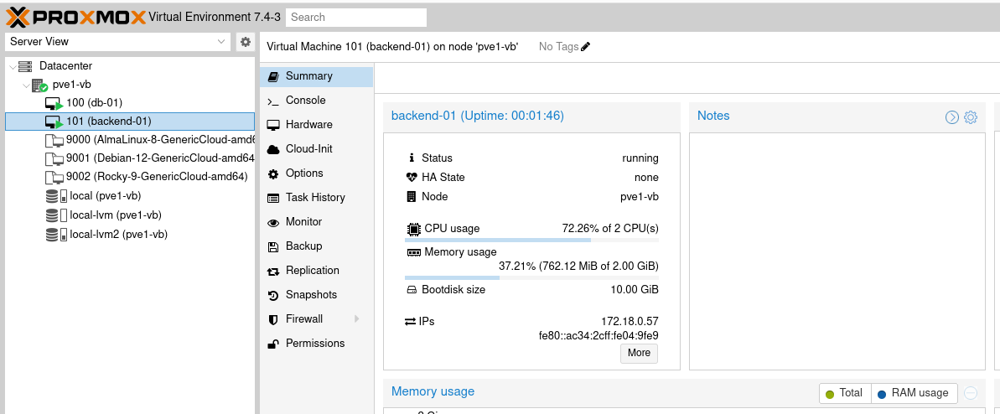
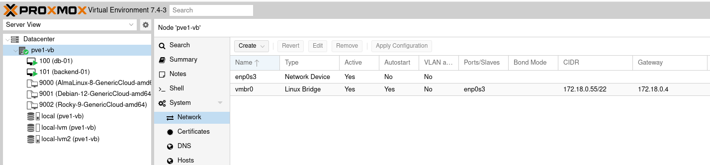
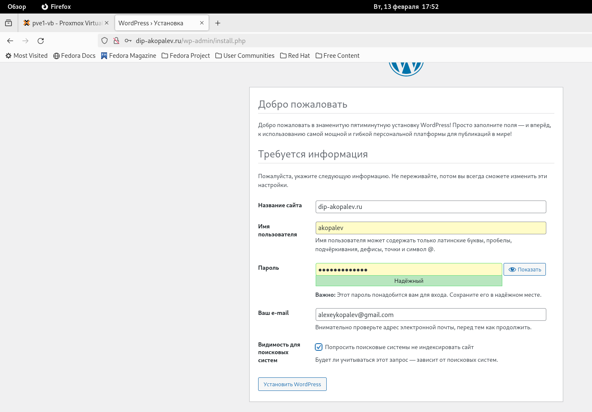
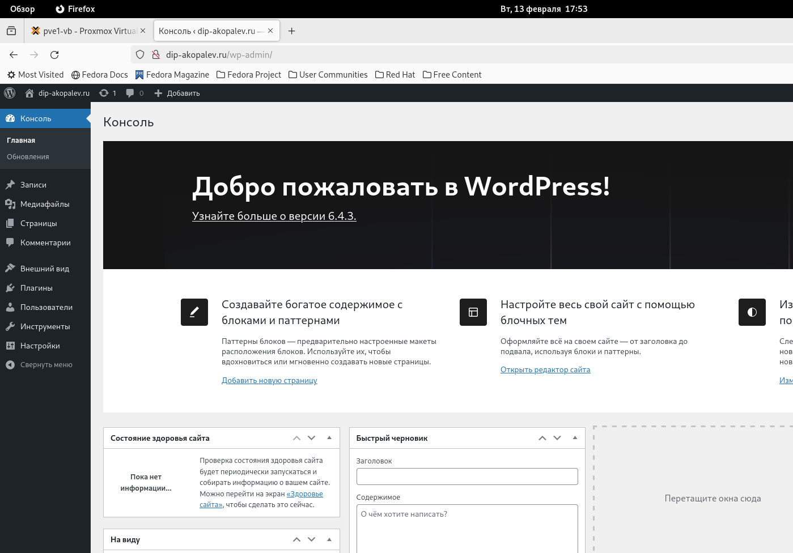
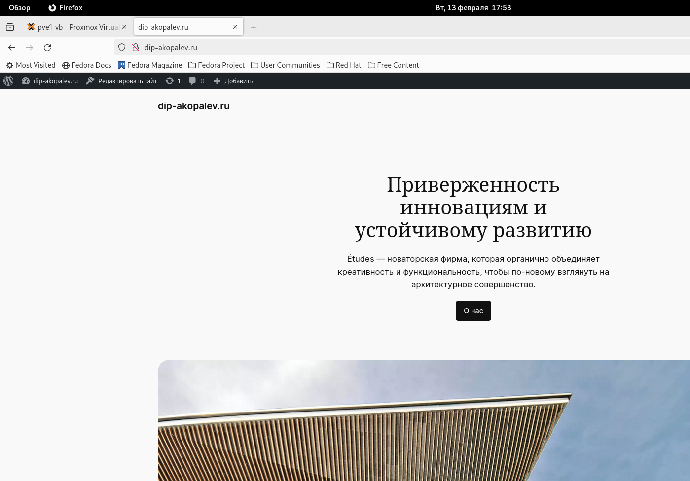

#  Копалев А. С. - Домашняя работа № 6

## Задача
Развертывание виртуальных машин на proxmox с помощью terraform
#### Цель
terraform скрипты для развертывания виртуальных машин на проксмоксе
#### Описание/Пошаговая инструкция выполнения домашнего задания:
Написать terraform скрипты для развертывания виртуальных машин на проксмоксе.
#### Выполнение
Для развёртки инфраструктуры создаем сервер Proxmox на Virtualbox, при помощи провайдера (Telmate/terraform-provider-proxmox) для Terraform создаем 2 виртуальные машины.
Через Terraform в Proxmox создаются следующие ресурсы:
- 1 виртуальная машина для postgreSQL 
- 1 виртуальная машина для бэкенда Wordpress

[main.tf](./main.tf)

Через Ansible реализуются 3 роли:
 - "chrony" - установка и синхронизация времени на всех виртуальных машинах
 - "install-postgresql" - устанавливает PostgreSQL создает БД Wordpress (переменные зашифрованы через ansible-vault)
 - "wordpress" - устанавливает на бэкенд сервере nginx и каталог wordpress, заменяет их конфиги
 
[playbook.tf](./ansible/playbook.yml)

## Скриншоты из Proxmox, созданного сайта, выводы при выполнении terraform apply и ansible-playbook playbook.yml

- созданные виртуальные машины
  

- созданные сетевой адаптер и бридж
  

- Заканчиваем установку Wordpress
  

- Работа админки сайта

- Работа сайта

- вывод terraform и ansible
  
- [terraform-output.txt](files/terraform-output.txt)
  
- [ansible-output.txt](files/ansible-output.txt)